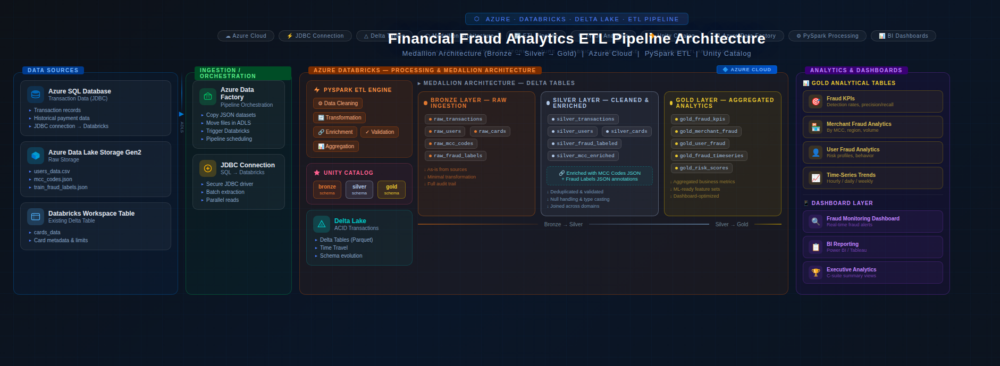

# Financial Fraud Analytics & Stock Market ETL Pipeline

## Introduction

This project focuses on building scalable data engineering pipelines using modern cloud-based technologies across two distinct use cases: a financial fraud analytics pipeline and a real-time stock market analytics pipeline. Both pipelines are built on a medallion architecture (bronze → silver → gold) using Azure Databricks, Delta Lake, and Unity Catalog.

### Part 1 — Financial Fraud Analytics ETL Pipeline

The fraud analytics pipeline ingests financial transaction data from multiple structured and semi-structured sources, organizes the data using a medallion architecture, and prepares analytical datasets for downstream fraud detection dashboards and business intelligence reporting.

The pipeline is built around a real-world fraud analytics use case involving transaction records, card information, user profiles, merchant category mappings, and fraud labels. It enables data cleaning, enrichment, aggregation, and analytics to support fraud monitoring and operational insights.

### Part 2 — Stock Market DLT Pipeline

The stock market pipeline ingests daily stock data for four ticker symbols (AAPL, GOOGL, AMZN, MSFT) from the Alpha Vantage API using Delta Live Tables. It computes price and volume trend analytics across 7, 30, and 90 day rolling windows and surfaces insights through a real-time Databricks AI/BI dashboard refreshed on a daily schedule.

Technologies used across both pipelines include:

- Azure Databricks
- Delta Live Tables (DLT)
- PySpark
- Azure SQL Database
- Azure Data Lake Storage Gen2 (ADLS Gen2)
- Azure Data Factory
- Unity Catalog
- Delta Lake
- JDBC
- Alpha Vantage REST API
- Databricks AI/BI Dashboards
- Databricks Workflows

---

# Part 1 — Financial Fraud Analytics ETL Pipeline

## Dataset and Analytics Work

The project used multiple financial datasets from both relational and file-based sources.

### Data Sources

1. **Azure SQL Database** — Transaction records ingested using JDBC, including transaction amount, merchant information, MCC codes, timestamps, card identifiers, and transaction errors

2. **Databricks Workspace Table** — Existing cards dataset already available inside the Databricks workspace

3. **Azure Data Lake Storage Gen2** — Users CSV dataset, MCC codes JSON mapping file, and fraud labels JSON file

### Bronze Layer

The bronze layer stored raw ingested datasets with minimal transformation. The following tables were created:

- `bronze.transactions_data`
- `bronze.cards_data`
- `bronze.users_data`

Raw JSON lookup files for MCC mappings and fraud labels were also stored in Azure storage for downstream enrichment.

### Silver Layer

The silver layer focused on cleaning, formatting, standardizing, and enriching transaction data. Transformations included removing duplicate records, parsing timestamps, standardizing numeric fields, cleaning currency formatting, creating time-based analytical columns, handling null values, joining fraud labels to transactions, and joining merchant category descriptions using MCC codes.

The transactions silver table was further enriched by joining card metadata (card brand, card type, credit limit, chip status, dark web flag) and user metadata (age, gender, income, debt, credit score) directly onto each transaction row, producing a fully denormalized analytical dataset.

Additional engineered columns included `transaction_date`, `transaction_hour`, `day_of_week`, `week_start`, `year_month`, `time_of_day`, `is_fraud`, and `merchant_category`.

MCC codes and fraud labels were also written as standalone silver reference tables:

- `silver.mcc_codes`
- `silver.fraud_labels`

### Gold Layer

The gold layer produced aggregated analytical tables directly answering business questions for the fraud dashboard. Each gold table maps to a specific analytical question:

| Gold Table | Business Question |
|---|---|
| `gold.fraud_by_day` | Which days of the week see the highest fraud volume? |
| `gold.fraud_trend` | What is the fraud rate trend over time? |
| `gold.top_fraud_users` | Which users have the most flagged transactions? |
| `gold.amount_spikes` | Are any users showing sharp rises in transaction amount? |
| `gold.fraud_by_mcc` | Which merchant categories have the highest fraud rate? |
| `gold.fraud_by_merchant` | Which merchants have unusually high fraud volume? |
| `gold.fraud_by_time` | How does fraud vary by time of day? |
| `gold.avg_amount_fraud_vs_non` | What is the average transaction amount for fraud vs non-fraud? |
| `gold.fraud_amount_by_mcc` | Which merchant category has the highest total fraud amount? |
| `gold.daily_fraud_losses` | What are total monetary losses due to fraud each day? |
| `gold.unique_fraud_users_weekly` | How many unique users commit fraud per week? |
| `gold.monthly_fraud` | Do fraud patterns show seasonal or monthly spikes? |
| `gold.behavior_shift` | How has user behavior changed before vs after a fraudulent event? |
| `gold.fraud_by_value` | Is fraud more common on high-value or low-value purchases? |

### Notes on Source Data

The fraud labels JSON file (`train_fraud_labels.json`) and MCC codes JSON file (`mcc_codes.json`) were stored as raw files rather than Delta tables. Both files used a flat key-value structure and required custom ingestion logic using Python's native `json` module due to Spark's `wholetext` option failing to read multiline JSON correctly in this environment.

Negative transaction amounts present in the fraud-labelled dataset represent chargebacks and refunds. These were filtered out of the daily fraud losses gold table since they represent recovered losses rather than actual financial damage, giving a gross fraud loss figure more meaningful for business reporting.

---

## ETL Architecture

### Architecture Components

**Azure SQL Database** — Stores and provides transactional financial data accessed through JDBC connections.

**Azure Data Lake Storage Gen2** — Centralized cloud storage for CSV datasets, JSON lookup files, Delta Lake storage, and managed catalog storage.

**Azure Data Factory** — Orchestrates and moves raw JSON datasets between storage locations for ingestion workflows.

**Azure Databricks** — Primary analytics and ETL engine for data ingestion, transformation, cleaning, schema management, Delta table creation, and medallion architecture implementation.

**Unity Catalog** — Organizes bronze, silver, and gold schemas.

**Delta Lake** — Stores transactional and analytical tables with optimized storage and query performance.

### Data Flow

1. Raw datasets ingested from Azure SQL via JDBC and Azure Storage via ADLS Gen2
2. Data stored in bronze Delta tables
3. Silver transformations clean, enrich, and denormalize transaction data
4. Fraud labels and MCC mappings joined to transactions
5. Card and user metadata joined to produce fully enriched transaction silver table
6. Gold layer aggregations computed for each analytical question
7. Dashboard built on top of gold tables

---

## Architecture Diagram



---

## Fraud Analytics Dashboard

The fraud analytics dashboard was built using Databricks AI/BI Dashboards on top of the gold layer tables. The dashboard is organized to tell a clear story: the scale of the problem, when and where fraud happens, what it costs, and who is doing it.


## Fraud Pipeline Orchestration

The fraud analytics pipeline is orchestrated using Databricks Workflows with three notebook tasks running sequentially:

```
Bronze_Notebook → Silver_Notebook → Gold_Notebook
```

Each task depends on the previous one completing successfully, ensuring that if silver processing fails, gold aggregations and the dashboard will not run with stale data.

---

# Part 2 — Stock Market DLT Pipeline

## Dataset and Analytics Work

### Data Source

Daily stock market data was ingested from the Alpha Vantage REST API for four ticker symbols: AAPL, GOOGL, AMZN, and MSFT. Two endpoints were used per pipeline run:

- `GLOBAL_QUOTE` — Latest daily price, volume, open, high, low, change, and change percentage
- `OVERVIEW` — Company metadata including sector, industry, market cap, P/E ratio, 52-week high/low, and dividend yield

The free tier of the Alpha Vantage API is limited to 25 requests per day and 5 requests per minute. With 2 API calls per symbol across 4 symbols, each daily pipeline run consumes 8 of the 25 available daily requests. A 15-second sleep between each API call was implemented to stay within the per-minute rate limit.

### Bronze Layer

The bronze layer stores raw API responses as string-typed Delta tables, one row per symbol per pipeline run. A historical backfill of 100 trading days was seeded using the `TIME_SERIES_DAILY` endpoint on the first run to enable immediate population of rolling window analytics.

- `bronze_stock_quotes` — Raw daily quote data per symbol
- `bronze_company_info` — Raw company overview per symbol

### Silver Layer

The silver layer casts all fields to appropriate types, parses dates, removes the percentage sign from change fields, and deduplicates on `symbol + trade_date` to prevent duplicate rows if the pipeline reruns on the same day.

Data quality is enforced using DLT `@dlt.expect_or_drop` rules that drop rows with null price, null symbol, or null volume rather than letting bad data flow through to gold.

- `silver_stock_quotes` — Cleaned and typed quote data with `trade_date` as the date key
- `silver_company_info` — Deduplicated to the latest record per symbol

### Gold Layer

The gold layer computes rolling window analytics on top of silver using Spark window functions partitioned by symbol and ordered by trade date.

**Price Trend Analysis (`gold_price_trends`)**

| Column | Description |
|---|---|
| `price_change_7d` | Absolute price change over 7 trading days |
| `price_change_30d` | Absolute price change over 30 trading days |
| `price_change_90d` | Absolute price change over 90 trading days |
| `price_change_pct_7d` | Percentage price change over 7 trading days |
| `price_change_pct_30d` | Percentage price change over 30 trading days |
| `price_change_pct_90d` | Percentage price change over 90 trading days |

**Volume Trend Analysis (`gold_volume_trends`)**

| Column | Description |
|---|---|
| `avg_volume_7d` | Rolling 7-day average daily volume |
| `avg_volume_30d` | Rolling 30-day average daily volume |
| `avg_volume_90d` | Rolling 90-day average daily volume |

Rolling window lag columns return null for dates where insufficient history exists. These fill in naturally as the pipeline accumulates daily data over time.

---

## DLT Pipeline Design Considerations

### Streaming Tables vs Materialized Views

Bronze and silver tables are defined as standard DLT tables that append new daily records on each triggered run. Gold tables are computed as aggregations over the full silver history, effectively acting as materialized views that are recomputed on each run.

### SCD Type

The pipeline implements SCD Type 2 by appending new daily records with `trade_date` as the natural key. The `dropDuplicates(["symbol", "latest_trading_day"])` deduplication in silver ensures no duplicate rows exist for the same stock on the same day even if the pipeline is rerun. Full history is preserved and queryable by date.

### Triggered vs Continuous

The pipeline runs in triggered mode — once daily at 6:30pm EST after US markets close. Continuous mode would be inappropriate for this use case as stock data updates once per day and would exhaust the 25 daily API request limit immediately.

### Handling Failures

Failure handling is implemented at three levels:

- `try/except` per symbol in bronze so a single failed API call does not abort the entire pipeline — the remaining symbols continue processing
- An `if not rows` guard that raises an exception and aborts the pipeline if zero symbols returned data, preventing empty tables from propagating downstream
- `@dlt.expect_or_drop` data quality rules in silver that drop malformed rows rather than passing nulls or invalid data through to gold
- Job orchestration `Depends on` dependencies ensure the dashboard refresh task only runs if the DLT pipeline task succeeds

---

## DLT Architecture

### Architecture Components

**Alpha Vantage API** — Source of daily stock price and company data via REST API.

**Azure Databricks** — Hosts the DLT pipeline, all Delta tables, and the AI/BI dashboard.

**Delta Live Tables** — Manages the full bronze → silver → gold pipeline from a single Python source file, handling dependency resolution, data quality enforcement, and incremental processing automatically.

**Unity Catalog** — All tables are written to `my_catalog.default` with bronze, silver, and gold table name prefixes.

**Databricks Workflows** — Orchestrates the daily triggered pipeline run and dashboard refresh.

### Data Flow

1. Alpha Vantage API called for GLOBAL_QUOTE and OVERVIEW endpoints per symbol
2. Raw responses stored in bronze Delta tables with a 15-second rate-limit buffer between calls
3. Silver layer casts types, deduplicates, and enforces data quality
4. Gold layer computes 7/30/90 day rolling price and volume analytics
5. Dashboard queries gold tables and refreshes automatically after each pipeline run

---

## DLT Architecture Diagram

[INSERT DLT ARCHITECTURE DIAGRAM HERE]

---

## Stock Market Dashboard

The stock market dashboard was built using Databricks AI/BI Dashboards on top of the two gold tables. A symbol filter and date range picker allow users to focus on specific stocks and time windows. All 4 symbols are stored in a single table and plotted as separate coloured lines on each chart, enabling direct visual comparison.


## Stock Pipeline Orchestration

The stock market pipeline is orchestrated using a Databricks Workflow job named `Stock_Pipeline_Daily` with two tasks:

```
Run_DLT_Pipeline → Refresh_Dashboard
```

The first task triggers the full DLT pipeline run covering bronze ingestion, silver cleaning, and gold aggregation. The second task refreshes the AI/BI dashboard and only runs if the pipeline task succeeds. The job is scheduled daily at 6:30pm EST after US markets close.

---

## Stock Pipeline Orchestration Diagram



---

# Future Improvements

1. Implement real-time fraud streaming using Structured Streaming and Kafka.

2. Add machine learning-based fraud prediction models using Spark MLlib or Azure Machine Learning.

3. Add automated monitoring and alerting for abnormal fraud spikes.

