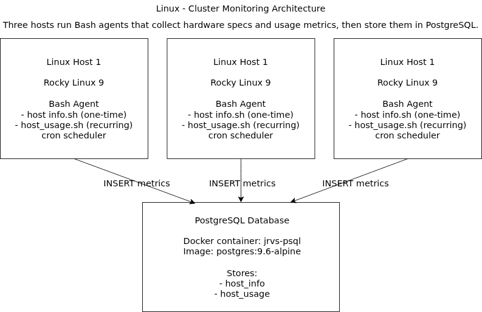

# Linux Cluster Monitoring Agent

# Introduction
Linux - Cluster Monitoring is a minimum viable product built for the Jarvis Linux Cluster Administration (LCA) team to monitor a Rocky Linux cluster. The project collects each host's **hardware specifications** (CPU, memory, cache, etc.) once at setup time and continuously captures **resource usage metrics** (CPU, memory, disk) at regular intervals. All collected data is persisted in a **PostgreSQL** database so LCA members can write SQL queries to generate operational reports and support future capacity planning (for example, identifying heavily loaded nodes or tracking average memory usage over time). The solution uses **Bash** scripts as lightweight monitoring agents, **cron** to schedule recurring usage collection, **Docker** to provision and run PostgreSQL (`postgres:9.6-alpine`), and **Git/GitHub** for source control and collaboration.

# Quick Start
```bash
# 1) Start a psql instance using psql_docker.sh (container: jrvs-psql, image: postgres:9.6-alpine)
cd scripts
./psql_docker.sh create
./psql_docker.sh start

# 2) Create tables using ddl.sql
psql -h localhost -p 5432 -U postgres -d host_agent -f sql/ddl.sql

# 3) Insert hardware specs data into the DB using host_info.sh (run once per host)
./host_info.sh localhost 5432 host_agent postgres <password>

# 4) Insert hardware usage data into the DB using host_usage.sh (run repeatedly per host)
./host_usage.sh localhost 5432 host_agent postgres <password>

# 5) Crontab setup (example: run every minute)
crontab -e
# Add the line below (update path + password handling as needed)
* * * * * bash /path/to/scripts/host_usage.sh localhost 5432 host_agent postgres <password> &> /tmp/host_usage.log 
````

# Implemenation

This MVP provisions a PostgreSQL database in Docker and deploys a lightweight Bash-based monitoring agent on each Linux host. The agent collects static host hardware data once and inserts it into `host_info`. For ongoing monitoring, the agent collects usage metrics at a fixed interval and inserts time-series rows into `host_usage`. Scheduling is handled by cron, allowing the LCA team to scale the solution by installing the agent scripts on each server and pointing them at the same PostgreSQL instance. The stored data can then be queried using SQL to generate utilization reports and support capacity planning decisions.

## Architecture



*Figure: Three Rocky Linux hosts run bash agents that insert metrics into a PostgreSQL database provisioned via Docker.*

## Scripts

### `psql_docker.sh`

**Description:** Automates provisioning and lifecycle management of the PostgreSQL Docker container (`jrvs-psql`) for persistent storage of cluster metrics.

**Usage:**

```bash
./psql_docker.sh create
./psql_docker.sh start
./psql_docker.sh stop
```

### `host_info.sh`

**Description:** Collects static hardware specifications for the current host (e.g., hostname, CPU count, CPU model, memory) and inserts a single record into `host_info`. Intended to be run once per host at installation time.

**Usage:**

```bash
./host_info.sh <psql_host> <psql_port> <db_name> <psql_user> <psql_password>
```

### `host_usage.sh`

**Description:** Collects current host usage metrics (e.g., memory free, CPU usage breakdown, disk I/O, disk available) and inserts a new record into `host_usage` each time it runs. Intended to be scheduled via cron (e.g., once per minute).

**Usage:**

```bash
./host_usage.sh <psql_host> <psql_port> <db_name> <psql_user> <psql_password>
```

### `crontab`

**Description:** Schedules recurring executions of `host_usage.sh` to continuously collect resource usage metrics.

**Example:**

```bash
* * * * * bash /path/to/scripts/host_usage.sh localhost 5432 host_agent postgres <password> >> /tmp/host_usage.log 2>&1
```

## Database Modeling

### `host_info`

| Column Name      | Type      | Description                       | Constraints      |
| ---------------- | --------- | --------------------------------- | ---------------- |
| id               | SERIAL    | Surrogate key for each host       | PK               |
| hostname         | VARCHAR   | Fully qualified hostname          | NOT NULL, UNIQUE |
| cpu_number       | INT2      | Number of CPU cores               | NOT NULL         |
| cpu_architecture | VARCHAR   | CPU architecture (e.g., x86_64)   | NOT NULL         |
| cpu_model        | VARCHAR   | CPU model name                    | NOT NULL         |
| cpu_mhz          | FLOAT8    | CPU frequency in MHz              | NOT NULL         |
| l2_cache         | INT4      | L2 cache size (KB)                | NOT NULL         |
| total_mem        | INT4      | Total memory (MB)                 | NOT NULL         |
| timestamp        | TIMESTAMP | Time when host info was collected | NOT NULL         |

### `host_usage`

| Column Name    | Type      | Description                                | Constraints        |
| -------------- | --------- | ------------------------------------------ | ------------------ |
| timestamp      | TIMESTAMP | Time when the usage snapshot was captured  | PK (composite)     |
| host_id        | INT4      | Host identifier referencing `host_info.id` | PK (composite), FK |
| memory_free    | INT4      | Free memory (MB)                           | NOT NULL           |
| cpu_idle       | INT2      | CPU idle percentage                        | NOT NULL           |
| cpu_kernel     | INT2      | CPU kernel percentage                      | NOT NULL           |
| disk_io        | INT4      | Disk I/O metric collected by the script    | NOT NULL           |
| disk_available | INT4      | Available disk space (MB)                  | NOT NULL           |

# Test

* **DDL testing:** Ran `sql/ddl.sql` against the `host_agent` database and confirmed tables and constraints were created successfully (verified via `\dt` and sample `SELECT` queries).
* **`host_info.sh` testing:** Executed the script manually and verified a correct row was inserted into `host_info` (values matched system outputs). Re-running did not create duplicate hostnames due to the unique constraint.
* **`host_usage.sh` testing:** Executed the script multiple times and verified each run inserted a new row into `host_usage` with a new timestamp and updated metrics. Verified values change when system load changes.

# Deployment

* **GitHub:** Source code was managed with Git and hosted on GitHub for version control and collaboration.
* **Docker:** PostgreSQL was provisioned via Docker using `postgres:9.6-alpine` with container name `jrvs-psql` and port mapping `5432:5432`.
* **Cron:** `host_usage.sh` was deployed on each host and scheduled with cron to run at a regular interval (e.g., every minute) for continuous monitoring.

# Improvements

* Handle hardware updates by detecting spec changes and supporting safe updates to `host_info` without breaking constraints.
* Improve security by removing plaintext passwords from crontab and using `.pgpass`, environment variables, or a secrets-based approach.
* Add stronger input validation and error handling (clearer logs, consistent exit codes, retries on transient DB failures).
