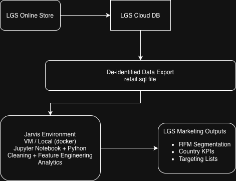

# London Gift Shop (LGS) Customer Analytics PoC

## Introduction
London Gift Shop (LGS) is an online UK giftware retailer with a meaningful wholesale customer base. Despite years of operating history and a large volume of transaction data, recent revenue growth has been flat. This project delivers a proof-of-concept (PoC) analytics workflow that converts raw order history into actionable customer and market insights.

LGS can use these results to run more targeted, higher-ROI marketing activities, for example:
- Segment-based campaigns (VIP retention, nurture journeys, win-back flows)
- Market prioritization (focus budget on countries with strong net sales and manageable cancellation or return risk)
- Smarter promotions (avoid discounting high-value customers unnecessarily, focus incentives on at-risk segments)

**Work delivered**
- A reproducible Jupyter Notebook that loads the provided transactional dataset, cleans and validates it, and produces customer and country-level analytics.
- Key analyses include:
  - **RFM segmentation** (Recency, Frequency, Monetary) to identify high-value and at-risk customers
  - **Country-level performance analytics** to guide which markets to prioritize for campaigns

**Tech stack**
- Python (data processing and analysis)
- Jupyter Notebook (analysis narrative and reproducibility)
- Pandas and NumPy (data wrangling, feature engineering, aggregation)
- SQL dataset input (`retail.sql`) exported from LGS systems (PII removed before delivery)
- Optional execution environment: local machine or VM, commonly via Dockerized tooling

---

## Implementation

### Project Architecture
This PoC follows a secure and lightweight flow. LGS provides a SQL dump of de-identified transactions instead of direct access to their cloud environment. Jarvis Consulting runs the analytics in an isolated environment and returns insights to LGS.

#### High-level data flow
1. LGS e-commerce platform generates transaction records in their cloud database.
2. LGS exports a de-identified transaction dataset as `retail.sql` (no names, phone numbers, addresses, etc.).
3. Jarvis loads the SQL dump into a local database (or reads it into the notebook environment).
4. Python analytics pipeline cleans, transforms, and aggregates the data.
5. Outputs are used to support marketing decision-making (segments, market priorities, KPI views).

#### Architecture Diagram (PoC)

### Data Analytics and Wrangling

#### Notebook

All implementation details, transformations, and results are documented here:

* **Notebook:** `./retail_data_analytics_wrangling.ipynb`

#### Dataset overview

Input: `retail.sql` containing transactional line items with:

* `invoice_no` (cancellation indicated by leading `C`)
* `stock_code`, `description`
* `quantity`, `unit_price`, `invoice_date`
* `customer_id`, `country`

#### Key wrangling steps (high level)

* Parsed invoice timestamps and enforced consistent types
* Identified cancellations using invoice number conventions
* Cleaned data issues commonly seen in retail datasets (null IDs, negative values tied to cancellations, duplicates when applicable)
* Built derived metrics such as line revenue and order-level revenue

#### How these analytics help LGS increase revenue

1. **RFM segmentation to target customers by lifecycle**

   * **Champions / Loyal**: retention, bundles, early access, premium upsell
   * **New / Promising**: onboarding flows, personalized recommendations, second-purchase triggers
   * **At-risk / Hibernating**: win-back offers, reactivation messaging, lower-cost channels first
     This improves conversion efficiency because messaging and promotions match customer value and risk.

2. **Country-level analytics to prioritize markets**

   * Compare countries by net sales, customer counts, and cancellation or return signals
   * Allocate budget to markets with strong net contribution and manageable cancellation risk
   * Adjust strategy in high-risk markets (tighter promo controls, different offer structures, clearer shipping or return messaging)
     This improves ROI by reducing wasted spend in low-converting or high-leakage regions.

3. **Cancellations and revenue leakage visibility**

   * Separating gross vs net sales prevents inflated performance views
   * Helps LGS refine promotions, fulfillment expectations, and campaign targeting rules
     This protects revenue by measuring what actually sticks, not just what is invoiced.

---

## Improvements

If more time were available, the next three improvements would be:

1. **Operationalize the pipeline**

   * Scheduled refresh (incremental loads)
   * Output curated tables such as `customer_rfm` and `country_kpis` for consistent reuse

2. **Add BI-ready reporting**

   * Build a marketing dashboard (Power BI/Tableau/Looker) using curated tables
   * Enable self-serve views by segment, country, and time period

3. **Extend analytics for stronger personalization**

   * Product affinity (basket analysis) to recommend bundles and cross-sell items
   * Cohort retention analysis to measure lifecycle performance and campaign lift over time

