# Spark Data Analytics on Databricks and Zeppelin

## Introduction

London Gift Shop (LGS) previously used a Jupyter Notebook and Python-based workflow to generate customer insights for its marketing team. That solution was useful for campaign planning and customer retention analysis, but it was built around single-machine processing. As the company expanded its data strategy, the existing workflow became less suitable for larger datasets and more demanding analytical workloads.

This project re-architects the analytics workflow using Apache Spark to support scalable data processing in a distributed environment. The work evaluates two Spark execution environments: Databricks on Azure and Zeppelin on Hadoop. On the Databricks side, I recreated the retail analytics workflow using PySpark and Spark SQL, loading data into a managed table and performing customer and sales analysis such as monthly sales, sales growth, order activity, active users, new versus existing users, and RFM segmentation. On the Zeppelin side, I used a World Development Indicators dataset for platform learning and comparison, focusing on GDP-based analysis with Spark on a Hadoop-backed environment provisioned through GCP.

Technologies used in this project include Apache Spark, PySpark, Spark SQL, Databricks, Zeppelin, Hadoop, Hive Metastore, Azure-based Databricks workspace components, GCP cluster provisioning, GitHub-hosted notebooks, and structured DataFrame APIs.

---

## Databricks and Hadoop Implementation

### Dataset and Analytics Work

The Databricks implementation uses a retail transaction dataset originally stored in a PostgreSQL dump. The data was parsed, loaded into Spark, and persisted as a table inside the Databricks catalog so that it could be reused throughout the notebook without repeating ingestion steps.

The notebook recreates the earlier business analytics workflow in PySpark, including:

- invoice amount distribution
- monthly placed and canceled orders
- monthly sales
- monthly sales growth
- monthly active users
- new and existing users
- RFM segmentation for customer behavior analysis

The retail analytics notebook is available here:

[Retail Data Analytics Notebook](https://github.com/jarviscanada/jarvis_data_eng_BasilSyed/blob/develop/spark/notebook/Retail_data_analytics_notebook.ipynb)

### Architecture

In the Databricks environment, the source retail data is transformed into a Spark DataFrame, validated, and then persisted as a managed table in the Databricks catalog. From there, PySpark DataFrame operations and Spark SQL-compatible logic are used to perform scalable analytics. The notebook executes on Databricks compute, allowing the analysis to move from a single-machine pandas workflow to a distributed Spark workflow.

Main architecture components include:

- GitHub repository for notebook storage and version control
- Azure Databricks workspace for notebook development and execution
- Databricks catalog and database schema for managed table storage
- Spark cluster / Databricks compute for distributed processing
- PySpark DataFrame API and Spark SQL logic for transformations and analytics

### Data Flow

1. Retail data is sourced from the PostgreSQL dump.
2. The raw dump content is parsed and converted into a Spark DataFrame.
3. The DataFrame is cleaned, typed, and validated.
4. The cleaned data is saved as a managed table in the Databricks catalog.
5. The notebook reads the table and performs distributed analytics using PySpark.
6. Results are displayed in notebook cells for business interpretation.

### Architecture Diagram

---

## Zeppelin and Hadoop Implementation

### Dataset and Analytics Work

The Zeppelin portion of the project was used to evaluate Spark in a Hadoop-based environment and compare the workflow against Databricks. While this notebook does not use the LGS retail dataset, it supports the project goal of assessing Spark execution environments through hands-on analysis.

The Zeppelin notebook uses the `wdi_csv_parquet` dataset and focuses on GDP-related analytics, including:

- showing GDP for each country and sorting by year
- finding the highest GDP value for each country
- showing historical GDP for Canada

The Zeppelin notebook is available here:

[Zeppelin Notebook](https://github.com/jarviscanada/jarvis_data_eng_BasilSyed/blob/develop/spark/notebook/Zeppelin_2MNUJSRY1.zpln)

### Architecture

For the Zeppelin implementation, the cluster was provisioned through GCP and accessed through the Zeppelin web interface. Spark jobs were executed in Zeppelin using `%spark.pyspark` paragraphs. The notebook queried data from a table registered in the Hadoop ecosystem, using Spark SQL tables backed by Hive Metastore. This setup helped evaluate how Spark behaves in a more traditional Hadoop-based environment compared with the managed Databricks experience.

Main architecture components include:

- GitHub repository for notebook storage and version control
- GCP-provisioned cluster environment
- Zeppelin web interface for interactive notebook execution
- Apache Spark for distributed processing
- Hadoop ecosystem storage and processing support
- Hive Metastore for table metadata
- PySpark code executed inside Zeppelin paragraphs

### Data Flow

1. Cluster infrastructure is provisioned on GCP.
2. Zeppelin connects to Spark in the Hadoop environment.
3. The notebook reads from the `wdi_csv_parquet` table.
4. PySpark transformations are applied to filter, group, sort, and join GDP-related data.
5. Results are displayed through the Zeppelin notebook interface for comparison and interpretation.

### Architecture Diagram

---

## Future Improvement

1. Add a fully automated ingestion pipeline so raw source files can be loaded into Spark tables without manual parsing or notebook-based preparation.

2. Expand the Databricks implementation by integrating external storage more formally, such as Azure storage services, and organizing data into a clearer bronze, silver, and gold structure.

3. Add notebook visualizations and dashboard-style reporting for both environments so that business users can compare outputs more easily.

---